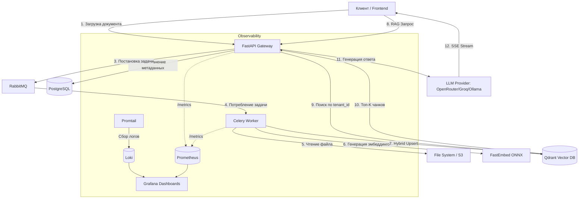

# Enterprise Knowledge Assistant (RAG System)

[](https://github.com/ProgKenhy/Enterprise_Knowledge_Assistant/actions/workflows/ci.yml)
[](https://www.python.org/)
[](https://fastapi.tiangolo.com/)
[](https://www.sqlalchemy.org/)
[](https://prometheus.io/)
[](https://grafana.com/)
[](LICENSE)

Production-ready система Retrieval-Augmented Generation (RAG) для интеллектуального поиска и анализа корпоративных документов с **полным стеком observability**, **строгой multi-tenant изоляцией** и **автоматизированным CI/CD**.

Проект демонстрирует инженерную зрелость: от асинхронной архитектуры до мониторинга метрик и логов в Grafana, автоматической генерации JWT-ключей и zero-config деплоя через Docker Compose.

---

## 🚀 Ключевые особенности

### 🎯 Архитектура и производительность
*   **Гибридный поиск (Hybrid Search):** Комбинация семантического (Dense, `paraphrase-multilingual-MiniLM-L12-v2`) и лексического (Sparse, `BM25`) поиска с алгоритмом **RRF (Reciprocal Rank Fusion)** для максимальной релевантности без тяжелых Cross-Encoder реранкеров.
*   **Оптимизация ресурсов:** Использование `fastembed` (ONNX-модели) вместо `transformers` + `PyTorch`. Потребление памяти снижено с **~3 ГБ до ~150 МБ**, что критично для деплоя на ограниченных ресурсах.
*   **Асинхронная архитектура:** FastAPI мгновенно принимает файл, а тяжелая задача парсинга и эмбеддинга делегируется Celery-воркерам через RabbitMQ, не блокируя основной поток.

### 🔒 Безопасность и изоляция
*   **Строгая Multi-tenant изоляция:** Каждый запрос к векторной базе (Qdrant) и реляционной БД (PostgreSQL) жестко фильтруется по `tenant_id`. Утечка данных между клиентами **архитектурно невозможна** (подтверждено интеграционными тестами).
*   **Автоматическая генерация JWT-ключей:** RSA-ключи генерируются при первом запуске через `entrypoint.sh`. Никаких секретов в git, никаких ручных действий.
*   **Production-ready аутентификация:** RS256 JWT токены с разделением на access/refresh, автоматическая ротация, защита от replay-атак.

### 📊 Observability и мониторинг
*   **Полный стек PLG (Promtail + Loki + Grafana):** Централизованное логирование всех контейнеров с возможностью поиска по LogQL и корреляции с метриками.
*   **Метрики Prometheus:** Автоматический сбор метрик FastAPI (RPS, latency, коды ответов) через `prometheus-fastapi-instrumentator`.
*   **Дашборды Grafana:** Готовые дашборды для мониторинга приложения (ID: 22676) и инфраструктуры (Node Exporter, ID: 1860).
*   **Мониторинг ошибок:** Отслеживание всех ошибок по контейнерам через `stream="stderr"` с автоматической алертацией.

### 🧪 Инженерная культура
*   **CI/CD из коробки:** GitHub Actions workflow с линтингом (Ruff), типизацией и полным набором тестов. Автоматическая генерация JWT-ключей в CI.
*   **Production-ready тестирование:** Комплексный набор тестов на `pytest` + `testcontainers`. Внешние зависимости (Celery, Qdrant, LLM) корректно мокаются через `app.dependency_overrides`.
*   **Строгая типизация:** Полное покрытие типами (Pydantic v2, SQLAlchemy 2.0), линтинг через Ruff, форматирование кода.

---

## 🏗 Архитектура системы



---

## 🛠 Технологический стек

| Категория | Технологии |
| :--- | :--- |
| **Backend** | Python 3.12, FastAPI, Pydantic v2, SQLAlchemy 2.0 (Async) |
| **AI / RAG** | FastEmbed (ONNX), Hybrid Search (Dense + Sparse), RRF Fusion |
| **LLM Integration** | OpenRouter, Groq, Ollama, vLLM (OpenAI-compatible API) |
| **Очереди и Кэш** | Celery, RabbitMQ, Redis |
| **Хранилища** | PostgreSQL 18, Qdrant (Vector DB) |
| **Observability** | Prometheus, Grafana, Loki, Promtail, Node Exporter |
| **DevOps & CI/CD** | Docker, Docker Compose, Poetry, Alembic, GitHub Actions, Pytest, Testcontainers |

---

## ⚡ Быстрый старт (Docker + Poetry)

Самый надежный способ запустить проект — использовать Docker, который автоматически настроит окружение, установит зависимости через Poetry и сгенерирует JWT-ключи.

### 1. Клонируйте репозиторий
```bash
git clone https://github.com/ProgKenhy/Enterprise_Knowledge_Assistant.git
cd Enterprise_Knowledge_Assistant
```

### 2. Настройте переменные окружения
Скопируйте пример файла конфигурации и заполните его:
```bash
cp .env.example .env
```

Откройте `.env` и укажите настройки LLM-провайдера:

**Вариант A: OpenRouter (рекомендуется)**
```env
LLM_MODEL=nex-agi/nex-n2-pro:free
OPENAI_API_KEY=sk-or-v1-ваш-ключ-от-openrouter
OPENAI_BASE_URL=https://openrouter.ai/api/v1
```

**Вариант B: Ollama (локально)**
```env
LLM_MODEL=qwen2.5:7b
OPENAI_API_KEY=ollama
OPENAI_BASE_URL=http://host.docker.internal:11434/v1
```

### 3. Запустите инфраструктуру
Соберите образы и запустите все сервисы в фоновом режиме:
```bash
docker compose up -d --build
```

**Что произойдет автоматически:**
- ✅ Установятся все зависимости через Poetry
- ✅ Сгенерируются RSA-ключи для JWT (`keys/private.pem`, `keys/public.pem`)
- ✅ Применятся миграции базы данных через Alembic
- ✅ Запустятся все сервисы: API, Worker, PostgreSQL, Qdrant, Redis, RabbitMQ, Prometheus, Grafana, Loki

*Этот процесс займет 1-2 минуты при первом запуске (скачивание баз данных и ONNX-моделей).*

### 4. Проверьте работоспособность
*   **API Документация (Swagger):** [http://localhost:8000/docs](http://localhost:8000/docs)
*   **RabbitMQ Management:** [http://localhost:15672](http://localhost:15672) (логин/пароль: `guest`/`guest`)
*   **Qdrant Dashboard:** [http://localhost:6333/dashboard](http://localhost:6333/dashboard)
*   **Prometheus UI:** [http://localhost:9090](http://localhost:9090)
*   **Grafana Dashboards:** [http://localhost:3000](http://localhost:3000) (логин/пароль: `admin`/`admin`)

---

## 📊 Мониторинг и Observability

Проект оснащен полным стеком мониторинга для контроля как приложения, так и инфраструктуры.

### Доступные дашборды в Grafana

После входа в Grafana ([http://localhost:3000](http://localhost:3000)) импортируйте следующие готовые дашборды:

#### 1. **FastAPI Observability** (ID: `22676`)
Мониторинг HTTP-запросов, latency, кодов ответов (2xx, 4xx, 5xx) и активности RAG-пайплайна.

**Как импортировать:**
1. Перейдите в **Dashboards** → **New** → **Import**
2. Введите ID: `22676`
3. Выберите источник данных: **Prometheus**
4. Нажмите **Import**

#### 2. **Node Exporter Full** (ID: `1860`)
Мониторинг ресурсов хоста: загрузка CPU, потребление RAM, место на диске и сетевой трафик. Критически важно для отслеживания OOM-событий при тяжелой обработке документов.

**Как импортировать:**
1. Введите ID: `1860`
2. Выберите источник данных: **Prometheus**

#### 3. **System Errors Monitor** (кастомный дашборд)
Отслеживание ошибок по всем контейнерам через Loki.

**Запросы LogQL:**
```logql
# Все ошибки (stderr) за последнюю минуту
count_over_time({stream="stderr"} [1m])

# Ошибки только в API
count_over_time({container="rag_api", stream="stderr"} [1m])

# Поиск конкретной ошибки
{container="rag_api"} |= "SyntaxError"
```

### Эндпоинты метрик
- **Приложение FastAPI:** `http://localhost:8000/metrics`
- **Node Exporter (хост):** `http://localhost:9100/metrics`
- **Prometheus UI:** `http://localhost:9090`
- **Loki API:** `http://localhost:3100`

---

## 🧪 Тестирование

Проект покрыт юнит- и интеграционными тестами с акцентом на **tenant isolation** и корректность RAG-пайплайна. Тесты запускаются локально через Poetry (для работы `testcontainers` локально должен быть запущен Docker-демон).

```bash
# 1. Установка всех зависимостей проекта (включая dev-зависимости для тестирования)
poetry install

# 2. Запуск всех тестов
poetry run pytest -v

# 3. Запуск с отображением print-вывода и логов (удобно для отладки)
poetry run pytest -v -s

# 4. Запуск тестов только для конкретного модуля (например, RAG-пайплайна)
poetry run pytest tests/rag/test_generator.py -v
```

**Ключевые тесты:**
- `test_chat_endpoint_strict_tenant_isolation` — проверка изоляции тенантов
- `test_chat_stream_endpoint_sse_format` — корректность SSE-стриминга
- `test_admin_can_upload_pdf` — загрузка и парсинг документов
- `test_cannot_get_other_tenants_document` — защита от утечки данных

---

## 🔄 CI/CD Pipeline

Проект включает автоматизированный CI/CD через GitHub Actions, который запускается при каждом push в ветки `main` и `develop`.

### Что проверяет CI:
1. **Lint & Type Check:** Ruff linter + formatter check
2. **Integration Tests:** Полный набор pytest тестов с моками внешних зависимостей
3. **Service Containers:** Автоматический запуск PostgreSQL, Redis, RabbitMQ, Qdrant
4. **JWT Key Generation:** Автоматическая генерация тестовых RSA-ключей

### Структура workflow:
```yaml
jobs:
  lint:
    - Ruff linter check
    - Ruff formatter check
  
  test:
    - PostgreSQL, Redis, RabbitMQ, Qdrant containers
    - poetry install
    - JWT keys generation (keys/generate_rsa_keys.py)
    - pytest -v --tb=short
```

**Статус CI:** [](https://github.com/ProgKenhy/Enterprise_Knowledge_Assistant/actions/workflows/ci.yml)

---

## 📂 Структура проекта

```text
.
├── alembic/                      # Миграции базы данных
├── src/eka/
│   ├── api/v1/endpoints/         # Слой маршрутизации HTTP-запросов
│   ├── core/
│   │   ├── indexing/             # Пайплайн парсинга и векторизации документов
│   │   └── rag/                  # RAG-пайплайн: Retriever (Hybrid+RRF) и Generator
│   ├── db/                       # Модели SQLAlchemy и конфигурация БД
│   ├── deps.py                   # FastAPI зависимости (DI, аутентификация)
│   └── tasks/                    # Celery-задачи для фоновой обработки
├── tests/                        # Pytest тесты (Unit + Integration)
├── monitoring/
│   ├── prometheus.yml            # Конфигурация Prometheus
│   ├── loki-config.yaml          # Конфигурация Loki
│   └── promtail-config.yaml      # Конфигурация Promtail
├── keys/
│   └── generate_rsa_keys.py      # Скрипт автогенерации JWT ключей
├── docker-compose.yml            # Оркестрация сервисов (включая мониторинг)
├── Dockerfile                    # Многоэтапная сборка образа
├── entrypoint.sh                 # Автоматическая генерация ключей + миграции
├── .github/workflows/ci.yml      # GitHub Actions CI/CD
└── pyproject.toml                # Конфигурация Poetry и зависимостей
```

---

## 🔮 Дальнейшее развитие (Roadmap)

Проект заложен с возможностью легкого расширения:

### ✅ Выполнено
- [x] Интеграция реального LLM-провайдера (OpenRouter, Groq, Ollama)
- [x] Полный стек Observability (Prometheus + Grafana + Loki)
- [x] Автоматическая генерация JWT-ключей
- [x] CI/CD pipeline с GitHub Actions
- [x] Production-ready тестирование с моками

### 🚧 В планах
- [ ] Добавление модуля оценки качества (RAGAS) для автоматического мониторинга метрик Retrieval и Generation.
- [ ] Внедрение трейсинга запросов через OpenTelemetry для distributed tracing.
- [ ] Поддержка потоковой загрузки больших файлов (Chunked Upload) для документов >100MB.
- [ ] Добавление истории чатов и feedback-механизма (👍/👎) для улучшения качества ответов.
- [ ] Интеграция с Keycloak для enterprise SSO (OAuth2/OIDC).

---

## 🎓 Чему учит этот проект

Этот проект демонстрирует не просто знание технологий, а **инженерное мышление**:

1. **Production-ready подход:** От автоматической генерации секретов до мониторинга ошибок в Grafana.
2. **Безопасность по умолчанию:** Строгая tenant isolation, JWT с RS256, секреты не в git.
3. **Масштабируемость:** Асинхронная архитектура с Celery, разделение ответственности.
4. **Observability:** Метрики + логи + дашборды = полная прозрачность системы.
5. **Инженерная культура:** CI/CD, тесты, линтинг, типизация, документация.

---

## 👤 Автор

Разработано с фокусом на лучшие практики Enterprise-разработки.  
Открыт для обсуждения архитектурных решений и возможностей сотрудничества.

**Контакты:**
- GitHub: [@ProgKenhy](https://github.com/ProgKenhy)
- Email: [gmail](sashok20053@gmail.com)

---

## 📄 Лицензия

MIT License — см. файл [LICENSE](LICENSE) для подробностей.

---

**Если этот проект был полезен для вас, поставьте ⭐ на GitHub!**