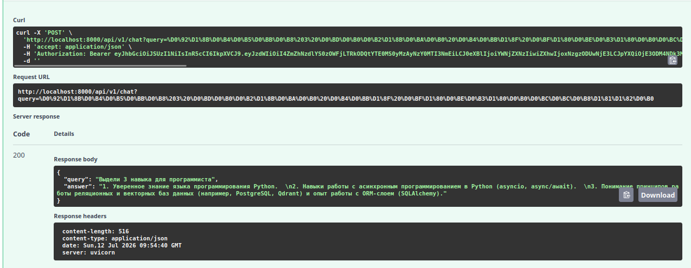
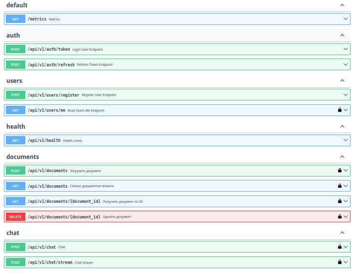
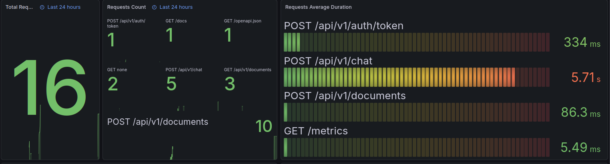
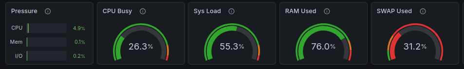
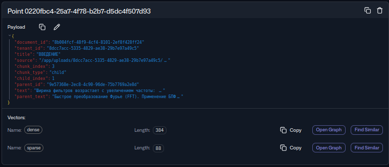
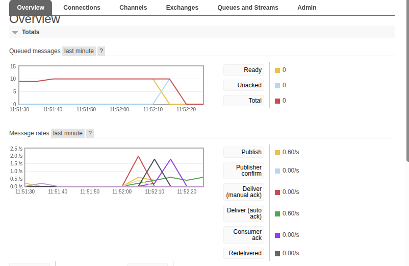
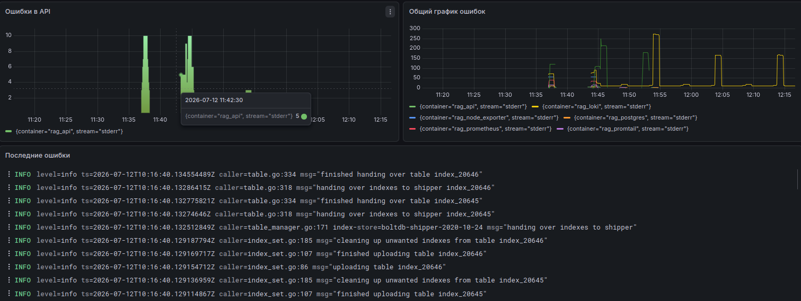
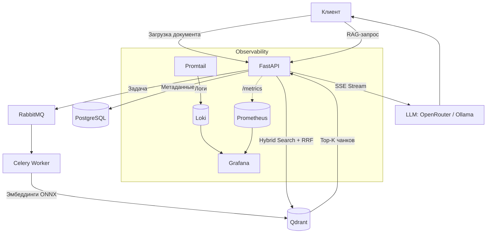

# Enterprise Knowledge Assistant (RAG System)

[](https://github.com/ProgKenhy/Enterprise_Knowledge_Assistant/actions/workflows/ci.yml)
[](https://www.python.org/)
[](https://fastapi.tiangolo.com/)
[](https://www.sqlalchemy.org/)
[](https://prometheus.io/)
[](https://grafana.com/)
[](LICENSE)

**Production-ready RAG-система** для интеллектуального поиска по корпоративным документам. Загрузи PDF/DOCX/HTML/TXT → документ индексируется в фоне → задавай вопросы на естественном языке, получай ответы с источниками.

Multi-tenant архитектура с гибридным поиском (Dense + Sparse + RRF), полным observability-стеком и zero-config деплоем одной командой.

---

## 📸 Система в действии

### RAG-ответ на реальный запрос


*`POST /api/v1/chat` — запрос на русском языке, структурированный ответ с конкретными навыками из загруженного документа. 200 OK, uvicorn.*

### Swagger UI — полное REST API


*Все эндпоинты: auth (token/refresh), users, documents (CRUD), chat (sync + SSE stream), health, metrics. Все защищены Bearer-токеном.*

### Метрики API в Grafana (Prometheus)


*За 24 часа: 10 загрузок документов, 5 RAG-запросов. Среднее время `/chat` — ~5.7 с (LLM-генерация через внешний API + векторный поиск).*

### Системные ресурсы (Node Exporter)


*CPU 26%, RAM 76%, SWAP 31% — всё запущено на одной машине: API + Worker + PostgreSQL + Qdrant + Redis + RabbitMQ + Grafana-стек.*

### Qdrant — точка данных с гибридными векторами


*Иерархический чанкинг в действии: child-чанк с `parent_id`, dense-вектор (384 dim) + sparse-вектор (88 ненулевых компонент) для гибридного поиска.*

### RabbitMQ — фоновая обработка документов


*10 задач индексирования поставлено в очередь → все обработаны Celery-воркером (0 оставшихся). Publish и Deliver auto-ack идут синхронно: 0.6 msg/s.*

### Мониторинг логов и ошибок (Loki)


*Centralized logging всех контейнеров через Promtail → Loki. Видны всплески stderr в `rag_api`, LogQL-поиск по контейнерам в реальном времени.*

---

## 🏗 Архитектура



---

## ⚡ Ключевые технические решения

**Гибридный поиск без реранкера**
Dense (`paraphrase-multilingual-MiniLM-L12-v2`, 384 dim) + Sparse (BM25, sparse dim) объединяются через RRF. Семантика + точные совпадения — без тяжёлых Cross-Encoder моделей.

**Оптимизация памяти: ×20**
`fastembed` (ONNX-инференс) вместо `transformers` + PyTorch — ~150 МБ против ~3 ГБ. Критично для деплоя на ограниченных ресурсах.

**Иерархический чанкинг**
Parent chunks (~1500 токенов) для контекста LLM + Child chunks (~400 токенов) для точного поиска. `parent_text` хранится в payload child-чанка — ноль дополнительных запросов к Qdrant при генерации ответа.

**Архитектурная изоляция тенантов**
Каждый запрос к Qdrant и PostgreSQL жёстко фильтруется по `tenant_id`. Утечка между клиентами невозможна по конструкции — подтверждено интеграционными тестами.

**Автогенерация секретов**
RSA-ключи для JWT (RS256) генерируются при первом запуске через `entrypoint.sh`. Никаких секретов в git, никаких ручных шагов.

**Настоящий SSE-стриминг**
Фоновый поток читает LLM-ответ токен за токеном, кладёт в `queue.Queue`. Async-код читает очередь через `asyncio.to_thread(queue.get)` — event loop не блокируется.

---

## 🛠 Стек

| Категория | Технологии |
| :--- | :--- |
| **Backend** | Python 3.12, FastAPI, Pydantic v2, SQLAlchemy 2.0 async |
| **AI / RAG** | FastEmbed ONNX, Hybrid Search (Dense + Sparse), RRF Fusion |
| **LLM** | OpenRouter, Groq, Ollama, vLLM (OpenAI-compatible) |
| **Очереди / Кэш** | Celery, RabbitMQ, Redis |
| **Хранилища** | PostgreSQL 18, Qdrant Vector DB |
| **Observability** | Prometheus, Grafana, Loki, Promtail, Node Exporter |
| **DevOps** | Docker, Docker Compose, Poetry, Alembic, GitHub Actions, pytest, testcontainers |

---

## ⚡ Быстрый старт

```bash
git clone https://github.com/ProgKenhy/Enterprise_Knowledge_Assistant.git
cd Enterprise_Knowledge_Assistant
cp .env.example .env
```

Укажи API-ключ в `.env` (модель уже задана в `config.py`):

```env
OPENAI_API_KEY=sk-or-v1-ваш-ключ   # OpenRouter (по умолчанию)
```

```bash
docker compose up -d --build
```

**Автоматически при старте:**
- ✅ RSA-ключи JWT сгенерированы (`entrypoint.sh`)
- ✅ Миграции Alembic применены
- ✅ Запущены: API, Worker, PostgreSQL, Qdrant, Redis, RabbitMQ, Prometheus, Grafana, Loki

*~2 минуты при первом запуске — скачивание ONNX-моделей*

**Локальный LLM без API-ключа (Ollama):**
```env
LLM_MODEL=qwen2.5:7b
OPENAI_BASE_URL=http://host.docker.internal:11434/v1
```

**Интерфейсы:**

| Сервис | URL | Доступ |
| :--- | :--- | :--- |
| API (Swagger) | http://localhost:8000/docs | — |
| Grafana | http://localhost:3000 | admin / admin |
| RabbitMQ | http://localhost:15672 | guest / guest |
| Qdrant | http://localhost:6333/dashboard | — |
| Prometheus | http://localhost:9090 | — |

---

## 📊 Observability

Импорт дашбордов: **Grafana → Dashboards → Import**

| Дашборд | ID | Источник данных |
| :--- | :--- | :--- |
| FastAPI Observability | `22676` | Prometheus |
| Node Exporter Full | `1860` | Prometheus |
| System Errors | кастомный | Loki |

LogQL для мониторинга ошибок:
```logql
{container="rag_api"} |= "ERROR"
count_over_time({stream="stderr"} [1m])
{container="rag_api"} |= "SyntaxError"
```

Эндпоинты метрик: `/metrics` (FastAPI), `:9100/metrics` (Node Exporter), `:3100` (Loki API).

---

## 🧪 Тесты

```bash
poetry install
poetry run pytest -v
```

**Ключевые сценарии:**
- `test_chat_endpoint_strict_tenant_isolation` — данные тенанта A не видны тенанту B
- `test_chat_stream_endpoint_sse_format` — корректный SSE-формат стриминга
- `test_cannot_get_other_tenants_document` — 404 вместо 403 (не раскрываем факт существования)
- `test_duplicate_file_rejected` — дедупликация по SHA-256

Внешние зависимости (Qdrant, LLM, Celery) изолированы через `app.dependency_overrides` и `testcontainers`.

---

## 🔄 CI/CD

GitHub Actions на каждый push в `main` / `develop`:

1. **Lint** — Ruff linter + formatter check
2. **Test** — pytest с реальными сервисами (PostgreSQL, Redis, RabbitMQ, Qdrant в контейнерах)
3. **JWT** — автогенерация RSA-ключей перед тестами

---

## 📂 Структура

```
.
├── src/eka/
│   ├── api/v1/endpoints/     # HTTP-маршруты
│   ├── core/
│   │   ├── indexing/         # Загрузчики (PDF/DOCX/HTML/MD), сплиттер, эмбеддинги
│   │   └── rag/              # HybridRetriever + RRF, Generator (SSE)
│   ├── db/                   # SQLAlchemy модели
│   ├── tasks/                # Celery-задачи индексирования
│   └── deps.py               # DI, аутентификация
├── tests/                    # Unit + Integration
├── monitoring/               # Prometheus, Loki, Promtail конфиги
├── keys/generate_rsa_keys.py
├── entrypoint.sh             # Автогенерация ключей + миграции
├── docker-compose.yml
├── Dockerfile                # Multi-stage build
└── pyproject.toml
```

---

## 🔮 Roadmap

- [x] Гибридный поиск (Dense + Sparse + RRF)
- [x] Иерархический чанкинг (parent/child)
- [x] Полный observability-стек (Prometheus + Grafana + Loki)
- [x] Автогенерация JWT-ключей, zero-config деплой
- [x] CI/CD с GitHub Actions
- [ ] RAGAS — автоматическая оценка качества Retrieval и Generation
- [ ] OpenTelemetry distributed tracing
- [ ] Keycloak SSO (OAuth2/OIDC)

---

## 👤 Автор

**[@ProgKenhy](https://github.com/ProgKenhy)** — открыт к обсуждению архитектурных решений и предложениям о сотрудничестве.

📧 sashok20053@gmail.com

---

*Если проект оказался полезным — поставь ⭐*