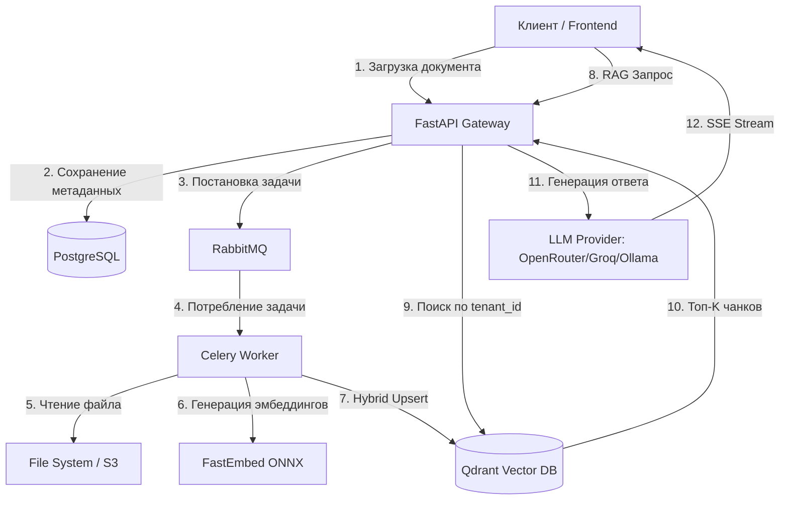

# Enterprise Knowledge Assistant (RAG System)

[](https://www.python.org/)
[](https://fastapi.tiangolo.com/)
[](https://www.sqlalchemy.org/)
[](LICENSE)

Высоконагруженная система Retrieval-Augmented Generation (RAG) для интеллектуального поиска и анализа корпоративных документов. 

Проект разработан с упором на **безопасность (строгая изоляция тенантов)**, **масштабируемость (асинхронная очередь задач)** и **инженерную культуру (покрытие тестами, строгая типизация, CI/CD-ready)**.

---

## 🚀 Ключевые особенности

*   **Гибридный поиск (Hybrid Search):** Комбинация семантического (Dense, `paraphrase-multilingual-MiniLM-L12-v2`) и лексического (Sparse, `BM25`) поиска с алгоритмом **RRF (Reciprocal Rank Fusion)** для максимальной релевантности без использования тяжелых Cross-Encoder реранкеров.
*   **Реальная интеграция с LLM:** Поддержка OpenRouter, Groq, Ollama, vLLM и любых OpenAI-совместимых API. Потоковый стриминг через SSE (Server-Sent Events) для мгновенной обратной связи.
*   **Строгая Multi-tenant изоляция:** Каждый запрос к векторной базе (Qdrant) и реляционной БД (PostgreSQL) жестко фильтруется по `tenant_id`. Утечка данных между клиентами архитектурно невозможна.
*   **Асинхронная архитектура:** Разделение ответственности. FastAPI мгновенно принимает файл, а тяжелая задача парсинга и эмбеддинга делегируется Celery-воркерам через RabbitMQ, не блокируя основной поток.
*   **Оптимизация ресурсов:** Использование `fastembed` (ONNX-модели) вместо тяжелого `transformers` + `PyTorch`. Потребление памяти снижено с ~3 ГБ до ~150 МБ, что критично для деплоя.
*   **Production-ready тестирование:** Комплексный набор тестов на `pytest` + `testcontainers`. Внешние зависимости (Celery, Qdrant, LLM) корректно мокаются, что гарантирует скорость выполнения тестов и отсутствие зависаний.

---

## 🏗 Архитектура системы



---

## 🛠 Технологический стек

| Категория | Технологии |
| :--- | :--- |
| **Backend** | Python 3.12, FastAPI, Pydantic v2, SQLAlchemy 2.0 (Async) |
| **AI / RAG** | FastEmbed (ONNX), Hybrid Search (Dense + Sparse), RRF Fusion |
| **LLM Integration** | OpenRouter, Groq, Ollama, vLLM (OpenAI-compatible API) |
| **Очереди и Кэш** | Celery, RabbitMQ, Redis |
| **Хранилища** | PostgreSQL 18, Qdrant (Vector DB) |
| **DevOps & Tools** | Docker, Docker Compose, Poetry, Alembic, Pytest, Testcontainers |

---

## ⚡ Быстрый старт (Docker + Poetry)

Самый надежный способ запустить проект — использовать Docker, который автоматически настроит окружение и установит зависимости через Poetry.

### 1. Клонируйте репозиторий
```bash
git clone https://github.com/your-username/enterprise-knowledge-assistant.git
cd enterprise-knowledge-assistant
```

### 2. Настройте переменные окружения
Скопируйте пример файла конфигурации и заполните его:
```bash
cp .env.example .env
```

Откройте `.env` и укажите настройки LLM-провайдера:

**Вариант A: OpenRouter (рекомендуется)**
```env
LLM_MODEL=nex-agi/nex-n2-pro:free
OPENAI_API_KEY=sk-or-v1-ваш-ключ-от-openrouter
OPENAI_BASE_URL=https://openrouter.ai/api/v1
```


**Вариант B: Ollama (локально)**
```env
LLM_MODEL=qwen2.5:7b
OPENAI_API_KEY=ollama
OPENAI_BASE_URL=http://host.docker.internal:11434/v1
```

### 3. Запустите инфраструктуру
Соберите образы и запустите все сервисы в фоновом режиме:
```bash
docker-compose up --build
```
*Этот процесс займет 1-2 минуты при первом запуске (скачивание баз данных и ONNX-моделей).*

### 4. Проверьте работоспособность
*   **API Документация (Swagger):** [http://localhost:8000/docs](http://localhost:8000/docs)
*   **RabbitMQ Management:** [http://localhost:15672](http://localhost:15672) (логин/пароль: `guest`/`guest`)
*   **Qdrant Dashboard:** [http://localhost:6333/dashboard](http://localhost:6333/dashboard)

---

## 🧪 Тестирование

Проект покрыт юнит- и интеграционными тестами с акцентом на **tenant isolation** и корректность RAG-пайплайна. Тесты запускаются локально через Poetry (для работы `testcontainers` локально должен быть запущен Docker-демон).

```bash
# 1. Установка всех зависимостей проекта (включая dev-зависимости для тестирования: pytest, testcontainers и др.)
poetry install

# 2. Запуск всех тестов
poetry run pytest -v

# 3. Запуск с отображением print-вывода и логов (удобно для отладки)
poetry run pytest -v -s

# 4. Запуск тестов только для конкретного модуля (например, RAG-пайплайна)
poetry run pytest tests/rag/test_generator.py -v
```

---

## 📂 Структура проекта

```text
.
├── alembic/                 # Миграции базы данных
├── src/eka/
│   ├── api/v1/endpoints/    # Слой маршрутизации HTTP-запросов
│   ├── core/
│   │   ├── indexing/        # Пайплайн парсинга и векторизации документов
│   │   └── rag/             # RAG-пайплайн: Retriever (Hybrid+RRF) и Generator
│   ├── db/                  # Модели SQLAlchemy и конфигурация БД
│   ├── deps.py              # FastAPI зависимости (DI, аутентификация)
│   └── tasks/               # Celery-задачи для фоновой обработки
├── tests/                   # Pytest тесты (Unit + Integration)
├── docker-compose.yml       # Оркестрация сервисов
├── Dockerfile               # Многоэтапная сборка образа
└── pyproject.toml           # Конфигурация Poetry и зависимостей
```

---

## 🔮 Дальнейшее развитие (Roadmap)

Проект заложен с возможностью легкого расширения:
1. [x] ~~Интеграция реального LLM-провайдера~~ ✅ Выполнено (OpenRouter, Groq, Ollama)
2. [ ] Добавление модуля оценки качества (RAGAS) для автоматического мониторинга метрик Retrieval и Generation.
3. [ ] Внедрение Observability: структурированные логи (Structlog), трейсинг запросов (OpenTelemetry) и метрики Prometheus.
4. [ ] Поддержка потоковой загрузки больших файлов (Chunked Upload) для документов >100MB.
5. [ ] Добавление истории чатов и feedback-механизма (👍/👎) для улучшения качества ответов.

---

## 👤 Автор

Разработано с фокусом на лучшие практики Enterprise-разработки.  
Открыт для обсуждения архитектурных решений и возможностей сотрудничества.
